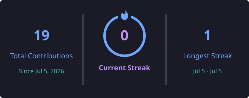

# 👋 Hi, I'm Gaurav Kumar

### 💻 Software Engineering Student | Full-Stack Developer | DSA Enthusiast

I'm a motivated **B.Tech Information Technology student** passionate about Software Development, Web Development and Problem Solving.

I enjoy building practical projects, learning new technologies and continuously improving my Data Structures & Algorithms skills.

  
  

---

## 👨‍💻 About Me

- 🎓 B.Tech in **Information Technology**
- 💻 Interested in **Software & Web Development**
- 🧠 Practicing **Data Structures & Algorithms**
- 🚀 Building **real-world projects**
- 🌱 Continuously learning and improving
- 📍 Kolkata, West Bengal, India

---

## 🛠️ Tech Stack

### 💻 Programming Languages

  
  
  

### 🌐 Web Development

  
  
  

### 🔧 Tools & Platforms

  
  
  

---

## 📚 Currently Learning

- 🧠 Data Structures & Algorithms
- 🌐 Full-Stack Web Development
- 🏗️ Building Real-World Projects
- ⚡ Improving Problem-Solving Skills

---

## 🎯 My Goals

- 📈 Improve my problem-solving skills
- 🚀 Build useful and impactful projects
- 🤝 Contribute to Open Source
- 💻 Become a strong Full-Stack Developer
- 🌱 Keep learning and growing as a Software Engineer

---

## 🚀 Featured Projects

### 🛡️ Women Safety Analytics

Android-based safety and protection system focused on live tracking, safety alerts and emergency response.

**Tech:** Android, Java/Kotlin

---

### 🌐 Personal Portfolio

My professional portfolio showcasing my skills, projects and development journey.

**Tech:** HTML, CSS, JavaScript

🔗 [View Portfolio](https://gauravkumar9798.github.io/portfolio/)

---

### 🛒 Amazon Clone

A front-end e-commerce website inspired by Amazon.

**Tech:** HTML, CSS

---

### 📱 Contact List App

A simple contact list application with search and add-contact functionality.

**Tech:** JavaScript

---

### 🧮 APPEL Calculator

A responsive calculator application built using web technologies.

**Tech:** HTML, CSS

---

## 💡 Problem Solving

- 🧩 Solved **200+ algorithmic problems**
- 💻 Regular practice on coding platforms
- 🧠 Strong focus on **Data Structures & Algorithms**
- ⚡ Continuously improving problem-solving skills

---
## 📊 GitHub Statistics

  
  

---

## 🔥 GitHub Streak

  

---

## 🤝 Connect With Me

---

## 💻 Build • Solve • Learn • Repeat

  <b>🚀 Turning ideas into projects and challenges into learning.</b>

  ⭐ Thanks for visiting my profile!

